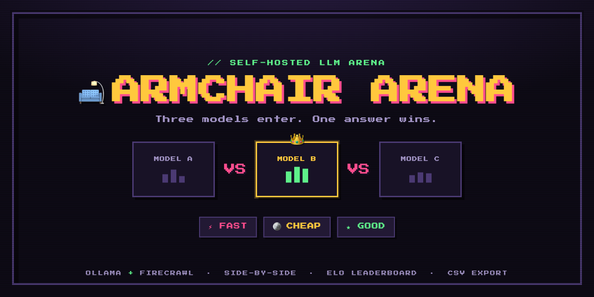
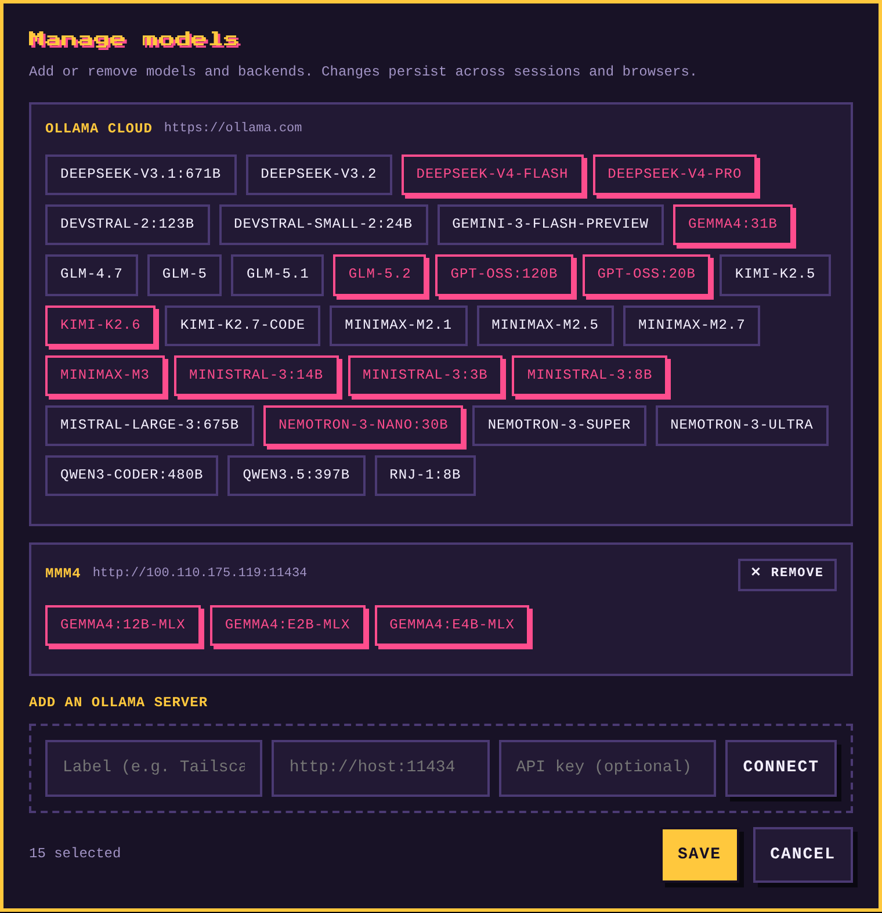
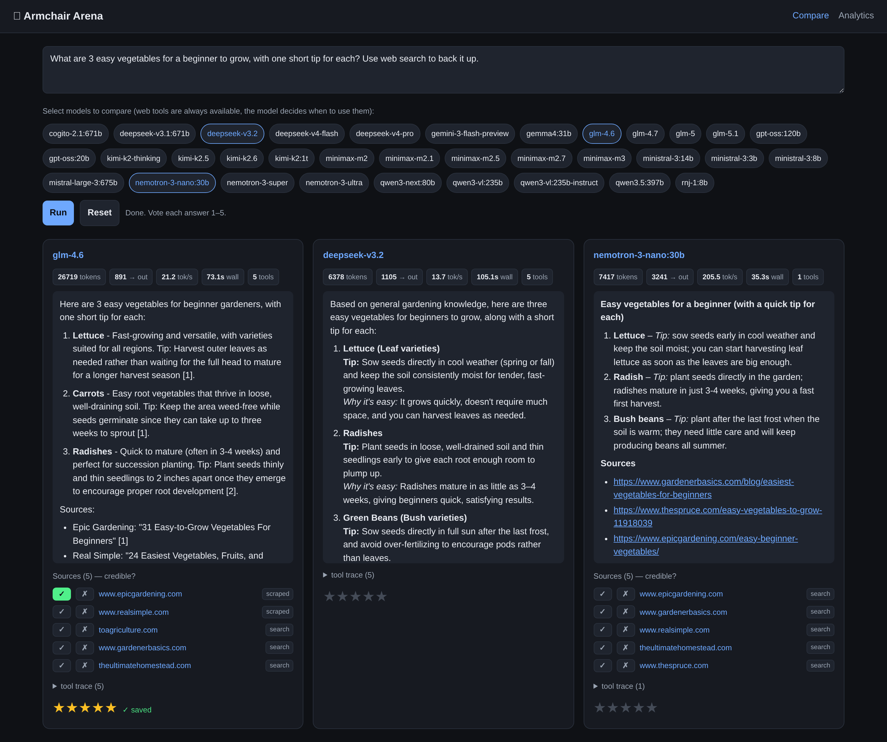
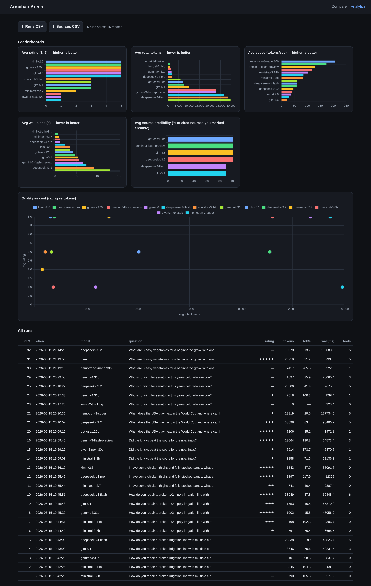

# 🛋️ Armchair Arena



**Judge LLMs from your armchair.** A tiny, self-hosted arena that pits three models against
each other on *your* real-world, non-coding questions — research, summarization, advice, recipes,
general knowledge — and scores them on the three things that matter day to day: **fast, cheap,
good.**

Too many open models, no idea which one to "set and forget"? Stop guessing. Ask one question, see
three answers **side-by-side**, crown the winner. Every round logs the question, answers, winner,
tokens, and wall-clock time to SQLite — and over many rounds that becomes a defensible,
**opponent-aware ranking** of what actually helps you.

Models are served through [Ollama](https://ollama.com) — **Ollama Cloud and/or any local/remote
Ollama servers you add by URL** (a workstation, a box on your tailnet). A first-run onboarding
screen lets you curate the roster; your picks are saved **server-side, so they persist across
sessions and browsers**. Every model gets the **same web-research tools** (self-hosted
[Firecrawl](https://github.com/firecrawl/firecrawl)) — so it's a fair fight.

---

## Screenshots

**Model manager** — on first run (and anytime via **⚙ Models**), curate who competes. Add a
local/remote Ollama server by URL, pick its models; selections persist across sessions and
browsers.



**Compare** — ask once; answers land side-by-side with live metrics, the source links each model
pulled, and a one-click **winner pick**.



**Analytics** — an opponent-aware **strength (Elo) leaderboard** across *all* your tests, a
quality-vs-cost scatter, and a sortable run table (with CSV export).



## Features

- **Curated roster, multi-backend** — first-run onboarding (and an edit-anytime **⚙ Models**
  manager) sets exactly which models the arena offers. Mix **Ollama Cloud** with **local/remote
  servers you add by URL**; each model is routed to its own backend automatically. Stored
  server-side in SQLite, so it **persists across sessions and browsers**.
- **Side-by-side comparison** — ask once, run exactly 3 models concurrently (random-seeded or
  hand-picked).
- **Real metrics** — tokens (prompt/completion), tokens/sec, wall-clock, and tool-call count,
  straight from Ollama's native `/api/chat` timing fields.
- **Consistent tool use** — identical `web_search` + `scrape_url` tools (Firecrawl) offered to
  every model with `tool_choice=auto`. Degrades gracefully: if search is down, models answer from
  their own knowledge (and `/api/health` says so).
- **Fair, current prompt** — same system prompt for everyone, with today's date injected (so
  "this year"/"latest" resolve), optional locale/units, and a nudge to cite source URLs.
- **Markdown answers**, rendered properly.
- **Winner pick** — mark the single best answer of the three (re-pickable; click again to clear).
  One decisive call per round instead of fuzzy 1–5 ratings, so the data stays quantifiable.
- **Source links** — every URL a model touched (search results + scraped pages), shown for
  context.
- **Opponent-aware strength + best-tradeoff finder** — every 3-way result feeds a **Bradley-Terry
  rating** (Elo-scaled; beating *strong* models counts more), shown with win-rate, a **95%
  confidence interval**, and a **low-data flag** so a small sample can't fake being the best. A
  Pareto **efficiency frontier** flags the models no other beats on strength, cost, *and* speed at
  once. Plus single-metric leaderboards, a strength-vs-cost scatter, a sortable run table, and CSV
  exports.
- **Model picker with tooltips** — hover any model for params, architecture, context window,
  capabilities (tools/vision/thinking), and quantization. The only discovery filter is age
  (`MAX_MODEL_AGE_DAYS`); everything else is selectable and curated via the roster.

## How it works

```
Browser ──> FastAPI app (this repo) ──> Ollama backends  /api/chat, /api/tags, /api/show
                  │                      (Ollama Cloud + any local/remote servers you add;
                  │                       each model routed to its own backend)
                  ├─────────────────────> Firecrawl  /v1/search, /v1/scrape  (web tools)
                  └─────────────────────> SQLite  (runs + sources + roster/backends config)
```

Your roster is resolved per-model at request time, so one comparison can span several Ollama
hosts. For each question, every selected model runs an independent tool-calling loop: it may call
`web_search`/`scrape_url`, the app runs them against Firecrawl and feeds results back, and the
loop continues until the model gives a final answer (or hits the tool budget, at which point it's
asked for a final answer with tools off).

## Requirements

- **Python 3.13+** and [**uv**](https://docs.astral.sh/uv/)
- **An Ollama backend** — either **Ollama Cloud** (API key from
  <https://ollama.com/settings/keys>, no GPU needed) or a **local Ollama daemon**
  (<https://ollama.com/download>)
- **A self-hosted Firecrawl** for the web tools — <https://github.com/firecrawl/firecrawl>
  (Docker; the app expects it at `http://localhost:3002`)
  > **Reliable search:** Firecrawl's default search scrapes DuckDuckGo, which anti-bot-blocks
  > after a few rapid queries (a side-by-side run is a burst) and returns empty — models then
  > answer from memory. Point Firecrawl at a [SearXNG](https://github.com/searxng/searxng)
  > instance (`SEARXNG_ENDPOINT`, JSON enabled) or a search-API key for dependable results.
  > `/api/health` → `web_tools: true` means a canary search actually returned hits.

## Quick start

```bash
git clone <your-fork-url> armchair-arena && cd armchair-arena

# configure
cp .env.example .env
$EDITOR .env            # set OLLAMA_API_KEY (cloud) or point OLLAMA_HOST at your local daemon

# install deps + run
uv sync
uv run python -m app
```

Or run `./setup.sh` (checks `uv`, creates `.env`, installs deps), then edit `.env` and
`uv run python -m app`.

Open the bind address you set (default `http://127.0.0.1:8090`). **First load opens an onboarding
screen** — pick your models (optionally add a local/remote Ollama server by URL), save. Re-edit
anytime via **⚙ Models**. Check `/api/health` to confirm every backend your roster uses is
reachable.

### Setup via an AI agent (Hermes / OpenClaw)

This repo ships an [`AGENTS.md`](AGENTS.md) with an explicit, verifiable recipe. Point your agent
at it — e.g. *"clone https://github.com/<you>/armchair-arena and follow AGENTS.md; here's my
Ollama API key."* It installs, fills in the key, starts the service, and confirms by polling
`/api/health`.

## Configuration (`.env`)

| Variable | Default | Description |
|---|---|---|
| `OLLAMA_HOST` | `https://ollama.com` | Base URL for the built-in **Ollama Cloud** backend. Use `http://localhost:11434` for a local daemon. Extra backends are added in-app (stored in the DB), not here. |
| `OLLAMA_API_KEY` | — | API key for the built-in cloud backend. Blank for a local daemon. |
| `FIRECRAWL_URL` | `http://localhost:3002` | Self-hosted Firecrawl base URL. |
| `BIND_HOST` | `127.0.0.1` | Bind address. `0.0.0.0` exposes it to your network. |
| `PORT` | `8090` | Port to serve on. |
| `MAX_MODEL_AGE_DAYS` | `365` | The **only** discovery filter: hide models not updated within this many days (`0` = show all). The roster curates the rest. |
| `USER_LOCALE` | — | Optional region/units context for every system prompt (e.g. "US, Mountain Time; prefer °F, US spelling, MM/DD/YYYY"). Empty = omitted. |
| `MAX_TOOL_ITERS` | `5` | Max tool-call rounds before forcing a final answer. |
| `SEARCH_SNIPPET_CHARS` | `1500` | Truncation cap per search result. |
| `SCRAPE_CHARS` | `6000` | Truncation cap per scraped page. |
| `REQUEST_TIMEOUT` | `300` | Per-request timeout (seconds). |

> **No authentication.** This app has no login. Only expose it on a trusted/private network
> (localhost, a VPN, a tailnet). Don't put it on the public internet.

## Deployment (systemd user service)

For a persistent install, see [`systemd/armchair-arena.service`](systemd/armchair-arena.service):

```bash
cp systemd/armchair-arena.service ~/.config/systemd/user/
systemctl --user daemon-reload
systemctl --user enable --now armchair-arena
loginctl enable-linger "$USER"   # survive logout/reboot
```

## API

| Method | Path | Purpose |
|---|---|---|
| `GET` | `/api/health` | Backend status: each Ollama backend the roster uses + a Firecrawl search canary (`web_tools` = search actually works). |
| `GET` | `/api/models` | The saved roster — the models the picker offers. |
| `GET` | `/api/roster` | Full roster + backends config for the manager (`onboarded`, `has_key`; API keys never returned). |
| `POST` | `/api/roster` | `{backends[], roster[]}` → persist the roster. Validates unique model names + known backends. |
| `POST` | `/api/probe` | `{backend_id}` or `{host, api_key}` → list a backend's models (age-filtered) for the manager. |
| `GET` | `/api/model_info?name=` | Metadata for one model (tooltip; routed to its backend). |
| `POST` | `/api/ask` | `{question, models[]}` (**exactly 3, in the roster**) → start a batch; returns `batch_id`. |
| `GET` | `/api/batch/{id}` | Poll a running batch for answers + metrics + sources. |
| `POST` | `/api/winner` | `{run_id, win}` → mark that run the batch winner (`win:false` clears it). |
| `GET` | `/api/analytics` | Per-model strength (Elo), win-rate + 95% CI, and cost/speed aggregates. |
| `GET` | `/api/runs` | All runs (raw). |
| `GET` | `/api/export.csv` | Runs CSV. |
| `GET` | `/api/export_sources.csv` | Sources CSV. |

## Data

SQLite at `data/eval.db` (created on first run):
- **`runs`** — one row per (question, model): answer, `win` (1 = picked winner of its batch),
  tokens, timings, tool trace, error. `model` is the plain model name (the analytics key), so the
  roster feature needed **no migration** and all historical analytics is preserved.
- **`sources`** — one row per URL a model touched: url, domain, role (`search_result`/`scraped`).
- **`settings`** — key→JSON store holding your roster + backends config (one row); this is what
  makes selections persist across sessions and browsers. API keys for user-added servers live
  here; the built-in cloud backend's key stays in `.env`.

## Notes

- Uses Ollama's **native** `/api/chat` (not the OpenAI-compatible surface) because it returns the
  token-count and timing fields the metrics rely on.
- Reasoning models (a `thinking` capability) are handled — if `content` is empty the app falls
  back to the `thinking` text.
- A model that returns empty content through a given backend is a real data point, but usually a
  backend/model quirk rather than an app bug.

## License

[MIT](LICENSE)
